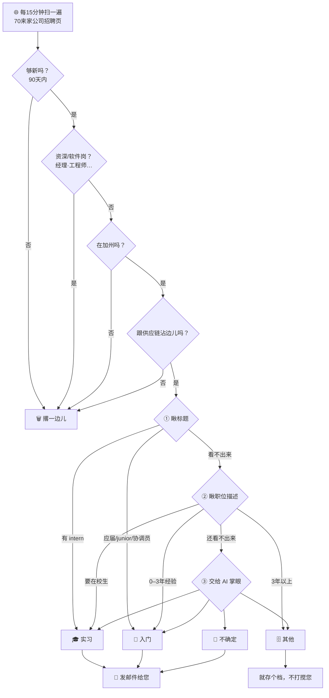

# 加州供应链找活儿神器 · 说明书儿 🕵️

> 这份儿说明是写给**收邮件那位**看的。全程大白话，倍儿好懂，
> 不用您懂技术，也不用您动一根手指头。（好这口硬核技术文档？那边儿请 👉 [README.md](README.md)，看秃了可别赖我。）

## 这到底是个嘛玩意儿？

说白了：这就是个**不用发工资、不用睡觉、还不摸鱼**的小机器人 🤖，专给您盯招聘网站的。

它整天蹲加州几十家公司的招聘页跟前儿，刷新刷新再刷新，眼都不带眨的，
一瞅见适合**应届生或者实习生**的「供应链管理（Supply Chain Management，简称 SCM）」岗位，
麻溜儿就给您邮箱发封信儿：「嘿！有活儿啦！快瞅瞅！」

您要干的事儿就一样——**嘛也甭干**。不用登录、不用设置、不用回信儿。
邮件来了，您瞄一眼，瞅着顺眼的点进去投简历，齐活儿。

## 它给您踅摸啥样的活儿？

- **地界儿**：就找**加州（California）**的岗位。（对，别的州它正眼都不带瞧的，专一着呢。）
- **方向**：供应链、物流、采购、计划、仓储、运营……反正就是「把东西从 A 倒腾到 B，还得又便宜又准时」那一挂。
- **级别**：**入门级**（应届 / 0–3 年经验）跟**实习**。
  那种张嘴就要您「十年经验起步」的，它早给您自动踢一边儿去了——省得您瞅着堵心。

## 您能收着啥样的邮件？

- **有新活儿就吱声儿**：一逮着新岗位，立马叮您一下。
- **每天早上 8 点来个汇总**：把过去一天的新岗位打个包再发一遍，您就着咖啡慢慢看。☕
- **没活儿就闭嘴**：没岗位的时候它绝不瞎叨叨，倍儿有分寸，局气。
- 同一个岗位**只吱声儿一回**，绝不跟某些群似的疯狂刷屏轰炸您。

## 邮件长啥样儿？

标题大概齐长这样：**`[SCM Job Alert] 3 new CA SCM posting(s) detected`**
（翻译过来就是：「逮着 3 个新岗位，麻溜儿来」）。

正文是个表格，一行一个活儿，跟这样 👇

| Type（类型） | Company（公司） | Title（职位） | Location（地点） | Area（区域） | Link（链接） |
|---|---|---|---|---|---|
| Entry-Level | Edwards Lifesciences | Supply Chain Analyst | Irvine, CA | Greater LA | Apply |
| Internship | Chevron | Supply Chain Intern – Summer 2026 | San Ramon, CA | SF Bay Area | Apply |
| Unsure | Illumina | Inventory Analyst | San Diego, CA | Other | Apply |

### 这几列都是嘛意思

- **Type（类型）**：这活儿是全职、实习、还是「机器人自个儿也拿不准」——底下细说。
- **Company（公司）**：哪家公司招人呢。
- **Title（职位）**：职位名儿（英文原话，公司咋写的它就咋搁着）。
- **Location（地点）**：上班的城儿，比方说 `Irvine, CA`（加州尔湾）。远程的会写成 `Remote (CA)`。
- **Area（区域）**：在加州哪块儿地界，方便您算通勤——总不能住湾区吧颠儿洛杉矶上班去，那不折腾人嘛。
- **Link（链接）**：点 **Apply** 直接蹦公司官网投简历去。**就这一列是正主儿，剩下那几列都是气氛组。**

### 「Type 类型」这仨都嘛意思

- **Entry-Level（入门级 / 全职）**：正经全职，应届或者经验不多（0–3 年）的主儿友好。
- **Internship（实习）**：实习 / 暑期项目，一般还得是在校生。
- **Unsure（不确定）**：机器人挠了挠头 🤔，闹不清是全职还是实习，干脆一块儿发您，您自个儿瞅。
  （它的原则就是：**宁可多发一条让您费这眼神儿，也绝不让您错过一个好机会。** 有点儿像那种给您占座的热心眼儿室友。）

### 「Area 区域」这仨都嘛意思

- **SF Bay Area（旧金山湾区）**：旧金山、圣何塞、奥克兰、桑尼维尔、弗里蒙特那一片儿。
- **Greater LA（大洛杉矶）**：洛杉矶、尔湾、长滩、阿纳海姆那一块儿。
- **Other（其他）**：圣地亚哥、萨克拉门托、中央谷地什么的，外加**远程岗**（穿着睡裤就把班上了那种，美着呢）。

## 收着邮件往后咋整？

1. 打开邮件，扫一眼表格。
2. 瞅着顺眼的，点这行最后头的 **Apply**。
3. 蹦到公司官网，照着提示传简历、填申请。得嘞，齐活儿！

> 💡 提个醒儿：**手快有，手慢无。** 入门跟实习岗位常常眨巴眼儿就满了，瞅着喜欢的甭犹豫，赶紧的。

## 🔍 后台揭秘：这机器人咋给您挑活儿的？

它可不是瞎发的啊。每个岗位都得先过一道**「安检」（筛选）**，再给**「贴上标签」（分类）**。
底下这张图您看个大概齐就成，**重点在最后那段儿——这套规矩您说了算。** 👇

**头一步：安检（筛选）—— 跟机场安检似的，一道关一道关地刷人：**

1. **够新吗？** 太老的岗位（搁了 90 天以上）直接跳过，省得您申请了个「考古现场」。
2. **是不是资深/软件岗？** 标题里带 经理、总监、senior、工程师(engineer) 这类词儿的，请您嘞——
   除非它明写着「供应链工程师」这种自己人，那另说。
3. **在加州吗？** 不在加州的，再好也白搭。远程岗必须写明是加州的才算数。
4. **跟供应链沾边儿吗？** 标题里得有 供应链、物流、采购、仓储、计划 这类词儿，要不然当场淘汰。
5. **重样儿的？** 同一个岗位只留一份儿，绝不让您收那种「已读乱回」的复读机。

**第二步：贴标签（分类）—— 三步走，越往后越机灵：**

- **① 先瞅标题。** 一眼能看出是实习还是入门的，当场盖章；看不出来的，接着往下走。
- **② 再瞅职位描述。** 要「在校生」→ 实习；要「0–3 年经验」→ 入门；「3 年以上」→ 归「其他」（太资深，不发您）。
- **③ 实在拿不准，请 AI（Gemini）掌眼。** 让它通读一遍，判成 入门 / 实习 / 不确定 / 其他。

末了分四类：**入门、实习、不确定**（这仨都发您），还有**其他**（就存个档，不打搅您）。

### 🛠️ 这套规矩，您说了算（欢迎挑刺儿 & 提需求）

上头这些是**眼下**的玩法。您完全可以吐槽它、改造它。瞅瞅底下这几条，有没有想调的，
记下来当**下一版「产品需求」**，我们给您定制 👇

- **级别**：就想看实习？就想看全职？还是也想瞄一眼稍微资深点儿的？
- **地区**：就盯湾区？就盯洛杉矶？还是加州全都要？
- **公司**：想加进某家心仪的公司？还是把某些不待见的删喽？
- **方向**：供应链里您最惦记哪一块儿——采购？物流？计划？仓储？能给您侧重。
- **关键词**：觉着某类岗位被误杀了，或者某些不该发的混进来了？您言语一声儿，调词库就得。
- **频率**：邮件太勤想改成一天一封？还是有新岗位立马就想知道？都能改。

> 一句话：**现在这版是「大路货」，您的反馈能把它捯饬成「高定款」。** 想着啥就记下啥，甭客气～ ✍️

📮 **有嘛反馈或者建议，欢迎撮合开发者 俞静阳（阳桑）** ——他倍儿乐意听您吐槽，随时给您调教这小机器人。🤖

## 常见的嘀咕

- **我得回这封邮件吗？** 甭。机器人不看回信儿，您夸它它也不带脸红的。
- **多咱发一回？** 有新活儿就发（大概每 15 分钟巡一遍），外加每天早上 8 点来个汇总。没活儿不吱声儿。
- **会发重样儿的吗？** 不会。同一个岗位只叮您一回，它记性好着呢。
- **邮件跑垃圾箱里去了咋办？** 把发件人搁进通讯录，或者标个「非垃圾邮件」，往后它就乖乖躺您收件箱里了。
- **它盯着哪些公司呢？** 加州 70 来家，横跨科技硬件、半导体、医疗器械、消费品、零售服装、航空航天、能源、咨询、物流……
  比方说 SpaceX、Chevron、Chipotle、Edwards Lifesciences、Northrop Grumman、Levi's、Skechers 这些，阵容倍儿豪华。
- **它帮我投简历吗？** 不帮。它管「发现机会」，您管「抓住机会」——分工明确，各干各的。😎

---

小机器人已经上岗喽，往后就瞧您的了。祝您麻溜儿拿下心仪的 offer！🎯🎉
