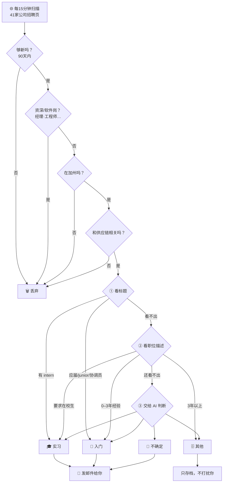

# 加州供应链工作提醒 · 使用说明 🕵️

> 这份说明是写给**收邮件的人**看的。全程大白话，不需要懂任何技术，
> 也不需要动一根手指头。（想看硬核技术文档？那边请 👉 [README.md](README.md)，小心别看秃了。）

## 这是啥？

简单说：这是一个**不用发工资、不用睡觉、也不会摸鱼**的小机器人 🤖，专门帮你盯招聘网站。

它整天蹲在加州几十家公司的招聘页面前刷新刷新再刷新，
一旦冒出适合**应届生或实习生**的「供应链管理（Supply Chain Management，简称 SCM）」岗位，
就立刻发一封邮件到你邮箱：「快看！有活儿了！」

你要做的事只有一件——**啥也不用做**。不用登录、不用设置、不用回复。
邮件来了，瞄一眼，看到心动的点进去投简历，完事。

## 它帮你找什么样的工作？

- **地点**：只找**加州（California）**的岗位。（对，别的州它一眼都不带看的，专一得很。）
- **方向**：供应链、物流、采购、计划、仓储、运营……总之就是「把东西从 A 搬到 B 还得便宜又准时」那一挂。
- **级别**：**入门级**（应届 / 0–3 年经验）和**实习**。
  那些要你「十年经验起」的岗位，它已经帮你自动屏蔽了——省得你看了糟心。

## 你会收到什么邮件？

- **有新岗位就发**：一发现新职位，立刻叮你一下。
- **每天早上 8 点来个汇总**：把过去 24 小时的新岗位打包再发一次，方便你边喝咖啡边看。☕
- **没新岗位就闭嘴**：没活儿的时候它绝不瞎打扰你，非常有分寸。
- 同一个岗位**只通知一次**，不会像某些群消息一样疯狂轰炸。

## 邮件长什么样？

标题大概长这样：**`[SCM Job Alert] 3 new CA SCM posting(s) detected`**
（翻译：「逮到 3 个新岗位，速来」）。

正文是个表格，一行一个职位，像这样 👇

| Type（类型） | Company（公司） | Title（职位） | Location（地点） | Area（区域） | Link（链接） |
|---|---|---|---|---|---|
| Entry-Level | Edwards Lifesciences | Supply Chain Analyst | Irvine, CA | Greater LA | Apply |
| Internship | Chevron | Supply Chain Intern – Summer 2026 | San Ramon, CA | SF Bay Area | Apply |
| Unsure | Illumina | Inventory Analyst | San Diego, CA | Other | Apply |

### 每一列都是啥

- **Type（类型）**：这活儿是全职、实习、还是「机器人也拿不准」——详见下面。
- **Company（公司）**：哪家公司在招人。
- **Title（职位）**：职位名（英文原文，公司咋写就咋写）。
- **Location（地点）**：上班的城市，比如 `Irvine, CA`（加州尔湾）。远程会写成 `Remote (CA)`。
- **Area（区域）**：在加州的哪块地界，方便你算通勤——总不能住湾区去洛杉矶上班吧。
- **Link（链接）**：点 **Apply** 直接跳到公司官网投简历。**这一列才是重点，其他都是气氛组。**

### 「Type 类型」的三种含义

- **Entry-Level（入门级 / 全职）**：正经全职，应届或经验不多（0–3 年）的人友好。
- **Internship（实习）**：实习 / 暑期项目，一般还得是在校学生。
- **Unsure（不确定）**：机器人挠了挠头，🤔 分不清是全职还是实习，干脆一起发给你自己瞅。
  （它的原则是：**宁可多发一条让你看，也绝不让你错过一个好机会。** 有点像帮你占座的热心室友。）

### 「Area 区域」的三种含义

- **SF Bay Area（旧金山湾区）**：旧金山、圣何塞、奥克兰、桑尼维尔、弗里蒙特那一带。
- **Greater LA（大洛杉矶）**：洛杉矶、尔湾、长滩、阿纳海姆那一片。
- **Other（其他）**：圣地亚哥、萨克拉门托、中央谷地等等，以及**远程岗位**（穿睡裤上班的那种）。

## 收到邮件后怎么办？

1. 打开邮件，扫一眼表格。
2. 看到顺眼的，点这一行最后的 **Apply**。
3. 跳到公司官网，按提示传简历、填申请。搞定！

> 💡 温馨提示：**手快有，手慢无。** 入门和实习岗位常常眨眼就满，看到喜欢的别犹豫。

## 🔍 幕后揭秘：机器人是怎么帮你挑活儿的？

它可不是瞎发的。每个岗位都要先过一遍**「安检」（筛选）**，再被**「贴标签」（分类）**。
下面这张图看个大概就行，**重点在最后一段——这套规则你说了算。** 👇

**第一步：安检（筛选）—— 像机场安检一样，一关一关刷人：**

1. **够新吗？** 太老的岗位（超过 90 天）直接跳过，免得你申请了个「考古现场」。
2. **是不是资深/软件岗？** 标题里带 经理、总监、senior、工程师(engineer) 之类的，请出去
   ——除非它明确是「供应链工程师」这种自己人。
3. **在加州吗？** 不在加州的，再好也不看。远程岗位必须写明是加州的才算。
4. **和供应链沾边吗？** 标题里得有 供应链、物流、采购、仓储、计划 这类词，不然当场淘汰。
5. **重复的？** 同一个岗位只留一份，绝不让你收到「已读乱回」的复读机。

**第二步：贴标签（分类）—— 三步走，越往后越聪明：**

- **① 先看标题。** 一眼能看出是实习或入门的，当场盖章；看不出的，往下走。
- **② 再看职位描述。** 要求「在校学生」→ 实习；要求「0–3 年经验」→ 入门；「3 年以上」→ 归为「其他」（太资深，不发你）。
- **③ 实在拿不准，请出 AI（Gemini）。** 让它读一遍，判成 入门 / 实习 / 不确定 / 其他。

最后分成四类：**入门、实习、不确定**（这三种都会发给你），以及**其他**（只存档，不打扰你）。

### 🛠️ 这套规则，你说了算（欢迎挑刺 & 提需求）

以上是**目前**的玩法。你完全可以吐槽它、改造它。看看下面这些，有没有想调整的，
记下来当作**下一版「产品需求」**，我们来帮你定制 👇

- **级别**：只想看实习？只想看全职？还是也想瞄一眼稍微资深点的岗位？
- **地区**：只盯湾区？只盯洛杉矶？还是加州全都要？
- **公司**：想加进某家心仪的公司？或者把某些不感兴趣的删掉？
- **方向**：供应链里你最想要哪一块——采购？物流？计划？仓储？可以侧重。
- **关键词**：觉得某类岗位被误杀了，或者某些不该发的混进来了？告诉我们，调词库就行。
- **频率**：邮件太勤想改成每天一封？还是希望有新岗位立刻知道？都能改。

> 一句话：**现在这版是「通用款」，你的反馈能把它变成「定制款」。** 想到啥就记下来，别客气～ ✍️

📮 **有任何反馈或建议，欢迎联系开发者 俞静阳（阳桑）** ——他很乐意听你吐槽，也随时帮你调教这个小机器人。🤖

## 常见问题

- **我要回复这封邮件吗？** 不用。机器人不看回复，你夸它它也不会脸红。
- **多久发一次？** 有新岗位就发（大约每 15 分钟巡一次逻辑），外加每天早上 8 点一次汇总。没活儿不发。
- **会发重复的吗？** 不会。同一个岗位只叮你一次，它记性好着呢。
- **邮件跑垃圾箱里去了咋办？** 把发件人加进通讯录，或标记「非垃圾邮件」，它以后就乖乖躺你收件箱了。
- **它盯着哪些公司？** 加州 41 家，横跨科技硬件、医疗器械、消费品、零售服装、航空航天、能源等，
  比如 SpaceX、Chevron、Chipotle、Edwards Lifesciences、Northrop Grumman、Levi's、Skechers……阵容挺豪华。
- **它会帮我投简历吗？** 不会。它负责「发现机会」，你负责「抓住机会」——分工明确，各司其职。😎

---

机器人已经上岗，接下来就看你的了。祝你早日拿到心仪的 offer！🎯🎉
